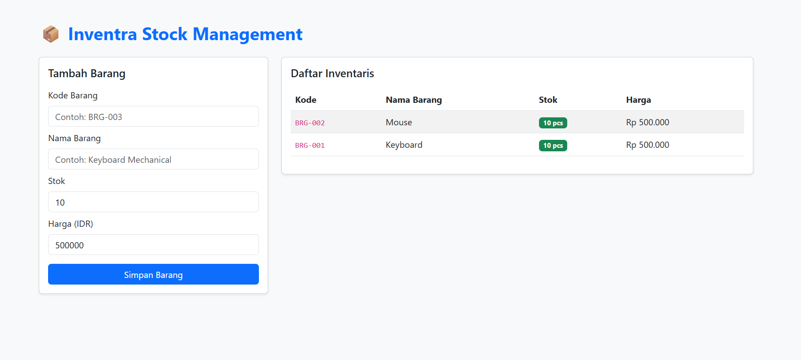

# Inventra - Inventory Management System
## 📸 Dashboard Preview


A web-based full-stack inventory management system built with Laravel, featuring a clean software architecture (Separation of Concerns), transaction-safe database mutations, and Eloquent eager loading to prevent performance bottlenecks.

## 🚀 Key Features & Architecture
- **Clean Architecture (Separation of Concerns):**
  - **Form Requests:** Isolated validation logic (`StoreItemRequest`).
  - **Service Layer:** Decoupled business logic and database transaction management (`InventoryService`).
  - **Thin Controllers:** Handled HTTP responses cleanly (`ItemController`).
- **Performance Optimization:** Implemented Eloquent Eager Loading (`with('category')`) to mitigate the N+1 query problem.
- **RESTful Endpoints & Interactive UI:** Offers both a JSON API interface and a Bootstrap 5 Blade dashboard.

## 🛠️ Tech Stack
- **Framework:** Laravel 12
- **Language:** PHP 8.2+
- **Database:** SQLite / MySQL
- **Frontend:** Blade, Bootstrap 5

## 🔧 Installation & Setup

1. **Clone the repository:**
   ```bash
   git clone [https://github.com/shin1745/laravel-inventra.git](https://github.com/shin1745/laravel-inventra.git)
   cd laravel-inventra